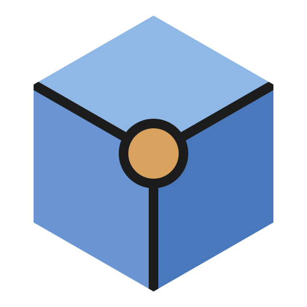

# SIEOS — Synthetic Intelligence Enhanced Operating System



A small Unix-style 64-bit kernel for x86_64. It boots from a hybrid BIOS/UEFI
ISO, runs on multiple CPUs (SMP) and supports multiple users with Unix
permissions. It has processes with signals, job control and environment
variables, pipes, and a read/write ext4 file system. It boots straight to a
graphical login screen and the Facet desktop, and a text console is one menu entry
away.

```
        +--------------------------------------------------------------+
        |          ____      ___     _____      ___      ____          |
        |         / ___|    |_ _|   | ____|    / _ \    / ___|         |
        |         \___ \     | |    |  _|     | | | |   \___ \         |
        |          ___) |    | |    | |___    | |_| |    ___) |        |
        |         |____/    |___|   |_____|    \___/    |____/         |
        |                                                              |
        |       Synthetic Intelligence Enhanced Operating System       |
        +--------------------------------------------------------------+
```

## Build and run

Requirements (Debian 13 or Ubuntu):

```sh
sudo apt install gcc g++ binutils make python3 curl zstd grub-pc-bin grub-efi-amd64-bin \
                 xorriso e2fsprogs qemu-system-x86 ovmf gperf pkg-config perl openssl flex bison cmake \
                 meson ninja-build glslang-tools python3-mako python3-yaml locales
```

- **KVM:** the build boots SIEOS in QEMU once, to compile ksh93 on SIEOS itself. With
  access to `/dev/kvm` (the `kvm` group, or the desktop session's access) this takes a
  few minutes; without it QEMU emulates the CPU, which is much slower.
- **Wi-Fi firmware** (optional): the AX201 firmware is copied from the build host's
  `/lib/firmware`: `firmware-iwlwifi` on Debian (from `non-free-firmware`),
  `linux-firmware` on Ubuntu. The AX210's (firmware API 77 and its `.pnvm`) is
  downloaded from linux-firmware's 20231211 release and checked against
  `ports/SHA256SUMS`.
- **Rust** (for Mesa's NVK): rustup (https://rustup.rs, in your home directory); `make
  rust-sieos` installs the pinned toolchain (1.99.0), builds Rust's standard library for SIEOS
  (`tools/rust-sieos`) and installs bindgen and cbindgen with cargo (bindgen uses the clang
  of the conda environment below, so the host needs no clang).
- **conda or mamba** (miniforge, https://conda-forge.org/download/) for NVK's build: clang and
  LLVM 20 with LLVM's SPIR-V translator, in an environment of the build tree
  (`tools/host-mesa-clc.sh`: Mesa's own shader tools for the build host).
- `cmake` builds llama.cpp, for the local model (`make brain`, the `llama-cpp` and
  `sia-brain` packages and `make usb-brain`), and LLVM and the Vulkan loader; `meson`,
  `ninja`, `glslangValidator` (glslang-tools) and Python's mako and yaml modules build Mesa
  (the `mesa` package).
- `gperf`, `pkg-config` and `perl` are for the web browser's libraries (NetSurf's own
  build generates code with them); `openssl` makes the package signing key and signs
  package indexes (see Packages).
- `locales` brings glibc's locale definitions (`/usr/share/i18n/locales`), from which
  `tools/mklocales.py` makes SIEOS's locale database (`/usr/lib/locale`: the numbers,
  money, dates and collation of 350 UTF-8 locales); without them SIEOS has only the C
  locales.
- `mkfs.ext4`, `debugfs` and `e2fsck` are in `/usr/sbin`, which a Debian user's `PATH`
  lacks; the Makefile adds it, so `make` needs no root and no `PATH` change.

The kernel is built by the host gcc in freestanding mode. The user programs are built
by an `x86_64-pc-sieos` cross compiler (GCC 15.2, binutils 2.45) against the C library
(musl 1.2.5 adapted to SIEOS). The first `make` builds everything from pinned release
tarballs, each checked against its SHA-256 (`ports/SHA256SUMS`, and
`toolchain/sieos-toolchain.py` for the toolchain):

1. the cross toolchain, into `build/cross`;
2. the C library, libsieos, libfacet, libsia, the programs and the drivers;
3. the GNU utilities, dash and e2fsprogs, cross-compiled;
4. the web browser: its libraries (zlib, libpng, libjpeg, expat, FreeType, Mbed TLS,
   curl, NetSurf's own) and NetSurf;
5. the native toolchain (binutils and GCC hosted on SIEOS, into `build/native`);
6. ksh93, compiled on SIEOS itself under QEMU (`tools/nativebuild.py`);
7. the ISO, the root file system and the disk.

A clean build took about 20 minutes on a 28-core machine with KVM, most of it
compiling GCC (twice: cross and native), so expect longer on fewer cores; later builds
reuse it all. Downloads (`tools/fetch.sh`) give up on a stalled
server after a minute, and a GNU tarball that ftp.gnu.org does not serve is fetched
through the `ftpmirror.gnu.org` mirrors.

```sh
make            # build/sieos.iso (BIOS + UEFI) and build/disk.img, toolchains included
make run        # BIOS boot, 4 CPUs, e1000 network, persistent disk, QEMU window + serial here
make run SMP=8  # any CPU count up to 64
make run-uefi   # the same through UEFI firmware (OVMF)
make run-nox    # serial console only (no window)
make run-iso    # the ISO alone: root fs is a RAM disk shipped on the ISO
make usb        # build/sieos-usb.img, to write to a USB drive for a real PC
make usb-brain  # build/sieos-usb-brain.img: the same with sia-brain, the local model (2.8 GB)
make run-usb    # boot sieos-usb.img in QEMU (UEFI) as a USB drive
make fsck       # check build/disk.img with e2fsck
make newdisk    # reset build/disk.img to the pristine root file system
make drivers    # the loadable drivers (build/drv/*.drv) and the boot archive
make clean      # remove build/
```

To write the USB image to a drive (all its data is lost; `/dev/sdX` is the drive itself,
see `lsblk`, not a partition):

```sh
sudo dd if=build/sieos-usb.img of=/dev/sdX bs=4M conv=fsync status=progress
```

Both USB images have every package installed (see Packages) on a partition of their own,
which a live system started from the drive mounts on `/usr/pkg`: packages installed later
from the repository stay on the drive, and the installer copies them all to the disk.
`sieos-usb.img` (710 MB) has every package except the local model; `sieos-usb-brain.img`
(2.8 GB, a drive of 4 GB or more) has the local model too, sia-brain (see
[sia-brain](#sia-brain-the-local-model)). `make run-usb-brain` boots it in QEMU.

**A hardware report:** a live system started from a USB drive writes what it found on
the machine and how its drivers did (`dmesg`, `lidev -v`, the links, a connectivity
check) to `hwreport/report-N.txt` on the drive's package partition (`sieos-pkg`, ext4),
45 seconds after it starts; any Linux can read it. `hwreport` writes one at any time;
an empty file `/usr/pkg/hwreport/off` stops the automatic ones.

The guest gets 1 GiB of memory (`make run MEM=2G` for more). The disk carries `gcc`,
`g++`, `as`, `ld` and the other binutils, the C and C++ headers and libraries, and
`sieos.h`/`libsieos.a`, so programs can be compiled on SIEOS itself:

```sh
gcc -O2 -o hello hello.c           # dynamically linked against /usr/lib/libc.so
g++ -O2 -o hello hello.cc          # libstdc++.so.6, libgcc_s.so.1
gcc -static -O2 -o hello hello.c   # static
```

Log in as **root / root** or **user / user**, then change these passwords with `passwd`.

The system boots into the graphical login screen (`sdm`). To get a text console, either:
- pick **SIEOS (text console)** in the GRUB menu (press Esc during the 2-second
  countdown to show it);
- click **Console** on the login screen, which runs one text login and then returns
  to the login screen;
- or put `CONSOLE=text` in `/etc/default/init`.

Networking uses QEMU's user-mode network. The guest gets 10.0.2.15 by DHCP, the host is
reachable as `10.0.2.2` (named `host` in `/etc/hosts`), and host port 8080 is forwarded
to the guest's port 80. Try running `httpd` as root in SIEOS, then `curl http://localhost:8080/`
on the host. Change the forwarding with `make run NET=user,model=e1000,hostfwd=...`.
IPv6 works too: QEMU advertises the prefix `fec0::/64`, so the guest configures
`fec0::5054:ff:fe12:3456` itself, and the host's `::1` is reachable as `fec0::2`
(for example `wget http://[fec0::2]:8000/` against `python3 -m http.server --bind ::1`).

To install SIEOS on a computer's disk, boot it from the USB drive (`make usb`), log in and
choose **Install SIEOS** in the SIEOS menu: pick the disk (all its data is erased),
confirm, give root's password, and restart without the USB drive. The installed system
boots through UEFI. `sieinstall` does the same from a shell (`sieinstall -l` lists the
disks).

The same ISO boots on legacy BIOS (El Torito, GRUB i386-pc) and on UEFI
(EFI system partition with GRUB x86_64-efi). It also carries a GPT/MBR hybrid,
so it can be written to a USB stick.

## Features

| Area        | Implementation |
|-------------|----------------|
| Boot        | GRUB multiboot2 → 32-bit stub builds page tables → long mode → higher-half kernel. Works on BIOS and UEFI. |
| Drivers     | Loadable: each driver is an ELF relocatable object (`/drv/NAME.drv`) that the kernel links against its own symbol table when a device matches the driver's aliases (`pciVVVV,DDDD`, `pciclass,CCSSPP`). GRUB loads a boot archive of them with the kernel, for the devices needed before the root is mounted, as Solaris does. `modinfo` and `modload`; a driver development kit in `/usr/include/ddk` and `/usr/share/ddk`. |
| Console     | VGA text mode, or a GOP/VBE linear framebuffer with an 8x16 font. Both handle ANSI colours and are mirrored to COM1. The kernel's messages are kept for `dmesg`. |
| Display     | QEMU's standard VGA (Bochs VBE), and Intel integrated graphics with its own mode setting (display versions 11 to 14: Ice Lake, Raptor Lake-S, Arrow Lake-P); the screen's resolution is chosen in Settings. |
| Input       | PS/2 keyboard and mouse (i8042, with the wheel in IntelliMouse mode); USB keyboards, mice and tablets on every xHCI controller (the chipset's and Thunderbolt ones), directly or through USB 2 hubs, plugged in at any time (mouse wheels included); HID-over-I2C touchpads and keyboards on the Intel LPSS I2C controllers (Raptor Lake, Ice Lake, Tiger/Alder/Meteor/Arrow Lake), found through the ACPI tables. Boot options `nousb`, `noi2c`, `usbdebug`, `i2cdebug`. |
| SMP         | Up to 64 CPUs, found through the ACPI MADT and started with INIT-SIPI-SIPI via a real-mode trampoline. Per-CPU GDT/TSS/idle process reached through `%gs` (`swapgs`). Local APIC timers preempt on every CPU, and idle CPUs are woken by reschedule IPIs. No big kernel lock: the kernel runs on every CPU at once, each subsystem with its own locks (Solaris's adaptive mutexes, condition variables and reader/writer locks; [docs/locking.md](docs/locking.md)), and device interrupts, the clock and the network run in kernel threads. |
| Memory      | Bitmap frame allocator over all RAM (up to 256 GiB), 4-level paging with a per-process address space, direct map of physical memory, kernel heap. |
| System calls | ABI v2, Solaris-inspired (Solaris errno values, signal numbers, flags and structure layouts), entered with the `syscall` instruction; specified in [`docs/abi-v2.md`](docs/abi-v2.md) and `abi/include/sieos/`. |
| Processes   | Processes with LWPs (threads), preemptive priority scheduling across CPUs with the Solaris TS, FX and RT classes (`priocntl`), copy-on-write `fork`, demand paging, `mmap` (private and shared, anonymous and file), `execve` of static, PIE and dynamically linked ELF64 programs (the kernel loads `PT_INTERP`), set-user-ID/set-group-ID, `waitid`, rlimits (with `RLIMIT_VMEM`) and rusage, ELF core files (`RLIMIT_CORE`), System V IPC, `/proc` (Solaris layout), `mount`/`umount2` of tmpfs and proc, `nanosleep` to the microsecond. |
| Signals     | Solaris numbering (1-41, real-time 42-73, queued). Default actions: terminate, core, stop, continue, ignore. `sigaction` handlers get a `ucontext`/`siginfo` frame, with `SA_RESTART`, `SA_RESETHAND`, `SA_NODEFER`, `SA_ONSTACK`; per-LWP masks, `sigtimedwait`, `sigqueue`, and system-call restart. |
| C library   | musl 1.2.5 adapted to ABI v2 (`libc/`), shared (`/usr/lib/libc.so`, which is also the dynamic linker `/lib/ld-musl-sieos64.so.1`) and static, with POSIX threads, the Solaris extensions (`thr_*`, `_lwp_*`, `gethrtime`, `processor_bind`, `sig2str`, ...) and a locale database (`/usr/lib/locale`: 350 UTF-8 locales, from glibc's data: `localeconv`, `nl_langinfo`, `strftime`, Unicode collation). libstdc++ and libgcc_s are shared too. |
| Toolchain   | An `x86_64-pc-sieos` cross compiler (GCC 15.2 C/C++, binutils 2.45) built by `make`, and the same compiler hosted on SIEOS (`make native`): SIEOS can compile programs, including its own. |
| Job control | Process groups and sessions (`setpgid`, `setsid`), a controlling terminal (`TIOCSCTTY`), and the foreground group (`tcsetpgrp`). ^C/^Z/^\ send SIGINT/SIGTSTP/SIGQUIT; background reads get SIGTTIN, and so do writes when `TOSTOP` is set; a session leader's exit sends SIGHUP. |
| Terminal    | termios with canonical and raw modes, `ECHO` (used for password prompts), and editable control characters. |
| Users       | Real, effective and saved uid/gid plus supplementary groups; `setuid`, `seteuid`, `setgid`, `setgroups`; `umask`; `access`. |
| Permissions | Owner/group/other `rwx` checks on every open, exec and directory search. Creating or removing files needs write+search on the directory. Sticky directories (`/tmp`) restrict deletion. The superuser bypasses checks. `chown` is restricted to root, as in Solaris's `rstchown`, and a non-root `chown` clears the set-ID bits. |
| Network     | PCI enumeration; interrupt-driven Intel e1000 and virtio-net drivers, USB Ethernet adapters (CDC ECM and NCM, such as the Realtek RTL8153 ones, plugged in at any time), with any number of cards as eth0, eth1, ... (each with its own addresses, DHCP and IPv6, and routes chosen per destination). Ethernet, ARP (with a queue for packets awaiting resolution), IPv4 routing through a gateway, loopback (127.0.0.0/8), ICMP echo, UDP, **TCP** and a **DHCP** client at boot. **IPv6**: neighbor discovery, stateless address autoconfiguration from router advertisements (with MTU and RDNSS), ICMPv6 echo, `::1`, and TCP and UDP over IPv6; `AF_INET6` sockets are dual-stack (IPv4-mapped peers) unless `IPV6_V6ONLY`. TCP covers the three-way handshake, MSS and window scaling, flow control, out-of-order reassembly, NewReno congestion control, RTT-based retransmission with backoff, zero-window probes, FIN/RST, TIME_WAIT and listen/accept backlogs. The **BSD sockets** API integrates with `read`/`write`/`poll`, including non-blocking `connect` (`EINPROGRESS`, then `poll` and `SO_ERROR`). Ports below 1024 and raw sockets require root. Realtek RTL8111/8168/8411 Gigabit Ethernet (polled). **Wi-Fi**: Intel Wi-Fi 6 AX201 and Wi-Fi 6E AX210 (Intel's firmware), scanning and WPA2-Personal, with `dladm`. |
| Power       | ACPI power-off (S5) and restart (reset register, 0xCF9), the power button; MWAIT idle states, Intel HWP or P-states with performance/balanced/power-saver policies, per-core and package temperatures (Intel DTS, AMD), passive cooling and a critical shutdown, desktop fan speeds (Nuvoton, ITE); `poweradm` and the Power and Temperature window. |
| Disks       | ATA (bus-master DMA), NVMe and virtio disks (`if=virtio` in QEMU, read-only images too), USB drives, plugged in at any time (mass storage, bulk-only: `c8t0d0p0`), GPT and MBR partitions (`/dev/dsk/c4t0d0s1`), a RAM disk from the ISO, lofi devices; `root=` on the boot command line picks the root partition; `mount -L LABEL DIR`. |
| Files       | ext4 read/write (see below), tmpfs (`/tmp`, `/dev/shm`), pipes and named FIFOs, `AF_UNIX` sockets (with descriptor passing), pseudo-terminals, `poll()`, record locks, and device nodes `/dev/console`, `/dev/tty`, `/dev/null`, `/dev/zero`, `/dev/random`, `/dev/urandom`, `/dev/fb0` and `/dev/events` stored as real ext4 character-special inodes. |
| Random      | `/dev/random` and `/dev/urandom` never block. They output a ChaCha20 keystream that is rekeyed after every read, from a pool fed by interrupt timing, the RTC and RDSEED/RDRAND when the CPU has them. |
| TLS         | A TLS 1.3 client in user space (`user/tls`): X25519 and P-256 key exchange, AES-128/256-GCM, RSA-PSS/PKCS #1 and ECDSA (P-256, P-384) signatures, X.509 chain and host-name validation against `/etc/ssl/certs.pem` (the Mozilla roots), plus optional site roots in `/etc/ssl/local.pem`, and session resumption with tickets. |
| ext4        | Extent trees, 64bit, flex_bg, and metadata_csum/gdt_csum checksums on every metadata structure. Supports create, write, truncate, mkdir, unlink, rmdir and `rename` (replacing targets, moving directories between parents with `..` and link-count updates). `getcwd` is computed from the directory tree, so it stays right after renames. |

### User space

The programs are C programs on the C library, linked dynamically; `libsieos`
(`user/libsieos`, `user/include/sieos.h`) holds the SIEOS extensions they share:

- **Shells:** `/bin/sh` is **ksh93** (ksh93u+m, the shell Solaris ships), built on SIEOS itself;
  `dash` (the ISO's `/bin/sh`); and `sish`, the earlier SIEOS shell. `help` lists the programs.
- **Login:** `init`, `login`, and `sish` (pipelines, `&&`, `||`, `;`, `&`, redirections including `2>&1`, `~`, variables `NAME=value`, `NAME=value cmd`, `$NAME`/`${NAME}`/`$?`, built-ins `cd [-] pwd exit umask export unset set jobs fg bg wait kill`).
- **Environment:** `env`, `printenv`; login sets `HOME USER LOGNAME SHELL PATH TERM`, and programs are looked up through `$PATH`.
- **Users and permissions:** `su` and `passwd` (both set-user-ID root), `useradd`, `id`, `whoami`, `groups`, `chmod` (octal and symbolic), `chown`, `chgrp`.
- **Files and text:** `ls -lad`, `cat`, `cp`, `mv` (rename), `tail`, `rm -rf`, `mkdir -p`, `rmdir`, `touch`, `grep`, `head`, `wc`, `hexdump`, `stat`, `tty`, `yes`, `true`, `false`.
- **Network:** `ifconfig`, `ping` (setuid root), `host`, `nc` (TCP/UDP client and server),
  `wget`, `httpd` (web server with directory listings), `netstat`, `netsurf` (the web
  browser, on the disk). The resolver uses `/etc/hosts` and then DNS.
- **System:** `ps` (with CPU column), `lscpu`, `nproc`, `kill`, `free`, `df`, `mount`, `umount`,
  `lofiadm`, `priocntl`, `getconf`, `uname`, `date`, `uptime`, `sleep`, `sync`, `clear`, `sifetch`,
  `dmesg`, `poweradm` (power policy, temperatures, fans), `halt`, `reboot`.
- **Drivers and devices:** `lidev` (each PCI function and its driver), `modinfo`, `modload`,
  `dladm` (`show-link`, `scan-wifi`, `connect-wifi`; the WPA2 passphrase is kept in the
  root-only `/etc/wifi.conf` and the network rejoined at boot), `fbset`.
- **Installation:** `sieinstall` (the installer, also in Facet).
- **Packages:** `pkg` (see Packages).
- **GNU utilities** in `/usr/gnu/bin`, as on Solaris 11: coreutils, sed, grep, diffutils,
  findutils, gawk, make (also `/usr/bin/make`), tar and gzip.
- **Development** (with `make native`): `gcc`, `g++`, `cpp`, `as`, `ld`, `ar`, `nm`, `objdump`, `readelf`, `strip` and the other binutils.
- **Self-tests:** `fstest`, `forktest`, `sigtest`, `abi2test`.

Accounts live in `/etc/passwd`, `/etc/group` and `/etc/shadow`, the last with mode 0400.
Passwords are salted SHA-256, iterated 5000 times. The `$5a$` format is specific
to SIEOS and is implemented in `user/libsieos/crypt.c` and `tools/mkshadow.py`.
Boot sequence: the kernel passes its command line (from GRUB) to `/sbin/init`, which
runs `/etc/rc` and then keeps a login running on the console: the graphical `/sbin/sdm`
by default, or `/bin/login` when the command line contains `text` or `single`. If `sdm`
fails three times in a row, init falls back to the text login.

### Graphical login (sdm)

`sdm`, the SIEOS display manager, draws a Strata-style card. It shows the logo, one
clickable chip per login account, and Name and Password fields. The buttons are
**Log In**, **Console**, **Restart** and **Shut Down**.
- Keys: Tab or the arrow keys switch fields, Enter moves on or logs in, and Esc clears
  the field.
- Authentication uses the same `/etc/shadow` hashes as `login`, with a one-second delay
  after a wrong password.
- On success, `sdm` gives the devices to the user (`/etc/logindevperm`), drops to the
  user's credentials and becomes that user's Facet session.
- **Log Out** in Facet returns to the login screen.

### Facet Desktop (graphical interface)

The desktop starts when you log in on the graphical login screen. From a text console,
run `facet` to start it, and use **Log Out** to return. Its look is called **Strata**: a
dark, layered-stone desktop with graphite surfaces, warm light text and one amber accent.
It borrows the calm surfaces of a modern dock and the working habits of a Solaris-era
workstation. All artwork is original. **Appearance** switches the whole desktop, while
programs run, between Strata and four other skins:
- **BeOS style:** yellow title tabs, the Deskbar, a blue desktop.
- **IRIX style:** 4Dwm-like frames, the Toolchest, an indigo desktop, a red pointer.
- **CDE style:** Solaris-like Motif frames, plum for the active window, and the Front
  Panel along the bottom with its four workspace buttons.
- **AmigaOS style:** Workbench-like blue title bars with close, zoom and depth gadgets,
  icons down the desktop's right side, a white screen bar, a red pointer.

Each skin has its own icons. Text is set in DejaVu Sans and DejaVu Sans Mono,
TrueType fonts rendered anti-aliased by libfacet at any size. The terminal zooms with
Ctrl and + or -.

Facet is a window manager and window server. Its applications (`facet-terminal`,
`facet-files`, `facet-viewer`, `facet-monitor`, `facet-network`, `facet-power`,
`facet-settings`, `facet-installer`, `facet-clock`, `facet-about`, `facet-message`) are
separate programs built on **libfacet**. Programs of
your own can be too, and can ask the model through **libsia** without handling the
connection. [docs/sdk.md](docs/sdk.md) explains both. The headers and libraries are
installed for the cross compiler and for SIEOS's own `cc`, with examples in
`/usr/src/examples`.

- **Spine** (the dock down the left edge):
  - the **SIEOS gem**, which opens the main menu: applications, every open window with
    its workspace, and Log Out;
  - one rounded tile per application: Terminal (sia), Shell, Files, System Monitor,
    Network Status and Clock. An amber mark shows which are running. Click a tile to open
    the application or bring its windows forward, right-click it for a new window, and
    hover over it for its name;
  - four **workspaces**. The current one is lit in its colour, and a dot marks those
    holding windows;
  - the clock.
- **Windows** have slightly rounded title bars.
  - The **window-menu button** on the left offers Minimize, Zoom, Send to Workspace N and
    Close, and the close box is on the right.
  - A band down the left edge takes the workspace colour (amber, blue, moss, plum) when
    the window has the focus.
  - Drag the title to move, double-click it to zoom, and drag the bottom-right corner to
    resize. Windows cast soft shadows.
- **sia strip** (along the bottom): the assistant's command line.
  - Press Ctrl+Space, click the strip, or simply start typing on the empty desktop, then
    press Enter. The line goes to the sia terminal, which opens if needed.
  - A light shows whether a model is connected and whether sia is working. Next to it are
    the model name and sia's last action, then CPU use and the IP address.
- **Keys:**
  - Ctrl+Space: the strip;
  - Ctrl+Alt+1..4 or Ctrl+Alt+Left/Right: workspaces;
  - Alt+Tab: next window;
  - Alt+F4: close.
- **Applications:** Terminal (sia, or the plain shell), Files and Viewer, System Monitor,
  **Network Status** (addresses, a live traffic graph and open sockets), **Web Browser**
  (NetSurf, see below), **SiPM** (the packages, see Packages), **Power and
  Temperature**, **Settings** (display resolution, appearance and the other desktop
  settings, one page per section), **Install SIEOS**, Clock and About. All of them follow
  the current skin.
- **Selection and clipboard:** text is selected with the mouse (a drag, or a
  double-click for a word) and copied from one program to another: Ctrl+C and Ctrl+V in
  the applications (text fields, the viewer, the web browser's page and address bar, the
  strip), Ctrl+Shift+C and Ctrl+Shift+V in the terminals (libfacet's
  `fct_clipboard_set`/`fct_clipboard_get`, a private file of the session; its text
  fields, `fct_field`).
- **Screen saver and lock:** after the idle time set in Settings (5 minutes by default,
  or never) the screen goes black; the lock then asks for the user's password (checked
  by `ckpw`).

The drawing library (`gfx.c`) now includes alpha blending, antialiased rounded rectangles
and soft shadows, all in integer arithmetic.

Kernel support behind it:
- `/dev/fb0`, which is mapped into the desktop process with `fbmap()`. The text console
  pauses while the desktop runs and repaints when it exits.
- `/dev/events` for keyboard and mouse events. Under QEMU, VMware and VirtualBox the
  mouse uses the hypervisor's absolute pointer (vmmouse), so the cursor follows the host
  pointer and the emulator never grabs the mouse. Elsewhere it falls back to a PS/2
  mouse, which is fully reset at boot so it always sends standard 3-byte packets.
- Pseudo-terminals (`openpty()`) and `poll()`.

`login` hands `/dev/fb0` and `/dev/events` to the console user through `/etc/logindevperm`,
as on Solaris.

### sia: the assistant (libsia), the terminal and the desktop strip

The assistant lives in a library, **libsia** (`user/libsia`, built as `libsia.a` on top of
`libtls.a`). Any SIEOS program can link it: it provides the Azure AI Foundry client, the
conversation engine, tools, configuration and the desktop channel (see `libsia.h`). Three
programs use it:

- **`/bin/sia`, the terminal.** A Facet **Terminal** opens it; **Shell Terminal** in the
  menus always opens the plain shell.
  - **Plain lines are commands.** They run directly with `/bin/sh -c`, attached to the
    terminal, without involving the model. `cd`, `export` and `unset` are handled by the
    terminal itself.
  - **`/sia REQUEST` asks the model**, for example `/sia which process uses the most
    memory?` or `/sia open the clock`. The model can run commands, and inside Facet it can
    also open applications and manage windows.
  - **A failed command goes to the model automatically.** This covers "not found" and
    non-zero exits that print an error. If there is one clear fix, as with `lss -l /etc`, the
    model runs the corrected command and says what it changed. Otherwise it explains the
    problem and lists the alternatives.
  - **Terminal commands:** `/help`, `/shell` (full shell with job control), `/clear`,
    `/auto on|off`, `/model`, `/setup` and `/tools`. Ctrl-C interrupts.
  - **The line is edited in place:** Up and Down recall earlier commands (kept in
    `~/.sia/history`), Left, Right, Home, End (Ctrl-A, Ctrl-E), Backspace, Delete,
    Ctrl-U and Ctrl-K. The plain shell (ksh93) edits its line the same way (its
    emacs mode, set in `/etc/shrc`).
- **`/bin/sia-agent`** runs libsia without a terminal and speaks JSON lines on
  stdin/stdout. Facet's strip uses it.
- **The Facet strip.**
  - Press Ctrl+Space, or start typing on the desktop, then ask for anything: "Open a new
    terminal for me", "launch the system monitor", "move the clock to workspace 2 and show
    me that workspace", "how much disk is free?".
  - Replies, the actions taken and short command output appear in a panel above the strip.
  - A change asks `Enter/y` (run), `n/Esc` (skip) or `a` (always); Esc interrupts.
- **Desktop tools.** Facet gives every program it starts a private pipe pair (fds 3/4,
  `SIEOS_DESKTOP=3,4`). libsia's desktop tools use it to open applications and to list,
  focus, close and move windows or switch workspaces. They are available in the strip and
  in every terminal.
- **Setup.**
  - The first use asks for the endpoint, the model or deployment name, and an API key
    (typed hidden), and stores them in `~/.sia/config` (mode 0600). Accepted endpoints are
    `https://NAME.openai.azure.com/`, `https://NAME.services.ai.azure.com/`, a serverless
    `https://X.REGION.models.ai.azure.com`, or a full `.../chat/completions` URL.
  - **Settings > Assistant** records several models (`~/.sia/models`) and marks the one in
    use: switching is one click, and the strip's sia follows. **Test** checks that a model
    answers and whether it sees images (which MiR uses to look at the applications it makes).
  - No image carries a model connection or a key: every user enters their own in SIEOS.
  - Without a model, or if it can't be reached, terminals start the standard shell.
    `sia --setup` reconfigures and `sia --off` unregisters.
- **Safety.**
  - A change asks for confirmation, unless it is exactly the command you typed or
    `/auto on` is set.
  - Read-only programs, and pipelines made only of them, run without asking.
  - Commands never inherit the desktop channel.
- **Network path.** Requests go out over SIEOS's own TCP/IP stack, DNS resolver and
  TLS 1.3 client (`libtls`).

For testing without Azure, `tools/mock_azure.py` serves a scripted chat-completions
endpoint over HTTPS, and `make tls-test` checks the cryptography against Python's
implementations.

### Try job control

```
user@sieos:~$ sleep 100 &
[1] 5
user@sieos:~$ cat
^Z
[2]+  Stopped                  cat
user@sieos:~$ jobs
[1]-  Running                  sleep 100
[2]+  Stopped                  cat
user@sieos:~$ bg %2 ; kill %1 ; fg %2
```

## Packages

The base system stays in the images; software added to it is managed as
packages, under `/usr/pkg`, from signed repositories (https://www.sieos.org/repo/
by default): with **SiPM**, the package manager's window (*SiPM (packages)* in the
SIEOS menu), or with `pkg`:

```sh
pkg update && pkg search          # what the repositories offer
pkg install git                   # with its dependencies (curl, openssl, zlib)
pkg list; pkg upgrade; pkg remove git
```

Available: **sia-brain** (the local model, see below) and **llama-cpp**, **mesa** and
**vulkan-loader** (OpenGL, EGL and Vulkan, see Graphics), **python** (see Python) and its
libraries **libffi**, **sqlite**, **bzip2**, **xz**, **ncurses** and **readline**, **git**, **rsync**, **openssh** (the ssh client: `ssh`, `scp`, `sftp`,
`ssh-keygen`, `ssh-agent`), **curl**, **openssl**, **zlib**, **lua**, **pigz**, **mir** and
**facet-git**. **Git** (`facet-git`) is a window for git:
- repositories: add, clone, new;
- changes: tick to stage, the diff, commit;
- history, and branches;
- fetch, pull and push;
- a Settings screen for the name and email of commits, and a token for HTTPS.

Packages with a window appear in the SIEOS menu.

Packages are built on the build machine from recipes in `ports/pkgs/` (`make pkgs`,
`make repo`), or on SIEOS itself from software built there (`pkg create`, `pkg add`).
Indexes are signed with a key kept outside the source tree
(`~/.config/sieos/pkg-signing-key.pem`), whose public half the images carry.
[docs/pkg.md](docs/pkg.md) has the details: recipes, formats, publishing and what
`pkg` checks.

## Graphics: OpenGL, EGL and Vulkan

The **mesa** package (`pkg install mesa`) gives programs **OpenGL ES 3.2**, **OpenGL 4.6**
and **EGL 1.5** (Mesa's llvmpipe) and **Vulkan 1.4** (lavapipe, through the Khronos
loader, package **vulkan-loader**).
- **Drawing:** done by the processor, with shaders compiled to x86 code by LLVM (AVX2
  and AVX-512 used).
- **Windows:** EGL draws into Facet windows, through its own platform: a program gives
  `eglCreateWindowSurface` its `fct_window *`.
- **Vulkan in windows:** through SIEOS's own extension, `VK_SIEOS_facet_surface`
  (`vkCreateFacetSurfaceSIEOS`: a surface on a `fct_window *`).
- **Demos:** `glcube` (*OpenGL cube* in the SIEOS menu), `vklogo` (*Vulkan logo*: the
  SIEOS logo turning) and `vkcompute`.

[docs/mesa.md](docs/mesa.md) has the details: writing an EGL program, Vulkan, how it is built.

## Python

The **python** package (`pkg install python`) is **CPython 3.14**: the interpreter, the
standard library with its C modules, and pip.
- **Modules:** `ssl` and `hashlib` (OpenSSL), `sqlite3`, `ctypes`, `zlib`, `bz2`,
  `lzma`, `curses` and `readline` work, through the library packages above.
- **Programs:** threads, `subprocess`, `multiprocessing`, `asyncio`, sockets and `venv`.
- **pip:** `pip3 install` takes pure-Python packages from PyPI, and builds packages with
  C code from their sources with SIEOS's gcc.
- **sia** knows when Python is installed, and runs Python scripts with its `sh` tool.

[docs/python.md](docs/python.md) has the details: what is there, pip, the test suite,
how it is built.

## Web browser

**Web Browser** in the Spine and the SIEOS menu opens [NetSurf](https://www.netsurf-browser.org/)
3.11 in a Facet window; from a shell, `netsurf [URL]`; sia opens it too ("open
example.com in the browser"). It renders HTML and CSS (CSS 2.1 and parts of CSS 3) with
PNG, JPEG, GIF, BMP and SVG images, in the DejaVu fonts, runs **JavaScript** (Duktape,
ECMAScript 5.1 with some later features), and fetches over HTTP and HTTPS through curl and
Mbed TLS (certificates checked against `/etc/ssl/certs.pem`). It is on the disk and the
USB image, not in the ISO's small root.

- **Address bar:** click it, **Ctrl+U** clears it, type the address, Enter. Home/End and
  Ctrl+Left/Right move the caret. (NetSurf's address bar has no select-all.)
- **Pages:** click links; scroll with the mouse wheel or the scroll bar (its trough
  moves a page, its arrows a line); the status bar shows the address of the link under
  the pointer; Back, Forward, Stop and Reload are on the toolbar. The window's title is
  the page's ("NetSurf: ...").
- **JavaScript** is on (`enable_javascript:0` in `~/.netsurf/Choices` turns it off).
  Scripts run as a page loads, and they can build and change the page then. They also
  have the DOM, timers and events such as clicks. As in NetSurf 3.11 everywhere, a change
  a script makes after the page has been laid out is not redrawn, except for the title
  and form fields. So pages that build themselves while loading work, but interactive
  updates do not show.
- **Not yet:** non-ASCII typing (the keyboard is US only). NetSurf's framebuffer front end
  has no right-click menu.

How it is built (`make netsurf`, part of `make`), into `build/ports`:

```sh
make netlibs        # zlib, libpng, libjpeg, expat, FreeType, Mbed TLS and curl (ports/netlibs.py)
make netsurf-libs   # NetSurf's own libraries (libcss, libdom, libhubbub, libnsfb, ...)
make netsurf        # NetSurf's framebuffer front end: build/ports/netsurf-root/usr/bin/netsurf-fb
```

`ports/netsurf/` holds the SIEOS parts: `nsfb-facet.c`, libnsfb's Facet surface (a
Facet window whose shared buffer libnsfb draws into directly, with keys, clicks, resizing
and closing turned into libnsfb's events), `netsurf-curl.patch`, with which the
fetcher resolves IPv4 addresses only when the machine has no global IPv6 address (as on
QEMU's user network), instead of waiting on IPv6 for every dual-stack site, and
`netsurf-title.patch`, which gives the page's title to the window, and the others listed
in `prepare.sh`. One of these, `netsurf-dom-dispatch.patch`, fixes libdom: it delivered
an event to its target twice, so a click handler ran twice. `prepare.sh` applies them and
sets the build options (`Makefile.config`): JavaScript with Duktape, whose bindings
nsgenbind (built for the build machine, with flex and bison) generates from WebIDL.

## Limitations

- ext4 journaling covers metadata (data=ordered). Changes are committed within five
  seconds and at `sync`, so a power cut loses at most those seconds, never consistency.
- The desktop renders in software (no GPU acceleration); so do OpenGL and Vulkan (the
  mesa package: llvmpipe, lavapipe).
- Network: no IPv6 privacy addresses or path MTU discovery, and no TCP SACK or timestamps.
- TLS: `libtls` speaks TLS 1.3 only (a server limited to TLS 1.2 is refused); the ported
  curl (below) uses Mbed TLS, which also speaks TLS 1.2.
- The C library has `eventfd()`, but the kernel has no `eventfd2` system call yet: it
  fails with `ENOSYS` (ports must be configured without it, as curl is).
- SMP: the dispatcher has one lock and no per-CPU run queues, there is no priority
  inheritance, and the network stack, the terminals, AF_UNIX sockets and ext4 each have
  one lock (docs/locking.md). Device interrupts go to the boot CPU through the I/O APIC.

## MiR: applications made by sia

**MiR** (Make it Real) makes the applications its user describes. It is a package, not
part of the base system: install **mir** with SiPM (or `pkg install mir`). Then ask sia
"make me an app that…" in the strip or a terminal, or open *MiR (make an app)* in the
SIEOS menu.

- A tall window holds the conversation. sia asks what it needs to know, then writes the
  program in C or C++ and builds it with SIEOS's own gcc and g++.
- It runs and tests it, and fixes it until it works. With a model that sees images, it
  also looks at the windows it makes; without one, MiR says the user has to look.
- The user tries it (**Run**), asks for changes, and has it installed (**Install**: in the
  SIEOS menu's **My apps**).
- Projects are kept in `~/apps/NAME`. MiR needs SIEOS installed on a disk or a USB drive,
  which has the compilers.

[docs/mir.md](docs/mir.md) has the details: the tools sia uses, the limits, the image test.

## sia-brain: the local model

**sia-brain** is a language model that runs on the computer's own processor, with no
network or account. It is built on Mistral AI's open model **Ministral 3 3B Instruct**
(Apache License 2.0), compressed to 2 GB, and runs on llama.cpp.

- **Getting it:** `pkg install sia-brain`, or the USB image `sieos-usb-brain.img`, which
  has it installed.
- **Using it:** *sia-brain (local)* in Settings > Assistant. sia uses it when no other
  model is registered, and starts it when needed (`sia-brain start|stop|status`).
- **What it needs:** about 4 GB of free memory. It answers at a speed that depends on the
  processor: about 20 tokens (some 15 words) a second in QEMU on 4 CPUs.

[docs/sia-brain.md](docs/sia-brain.md) has the details: the licence, the USB image's
partition, how the model is made (`make brain`).

## Layout

```
kernel/          kernel sources and include/
drv/             the loadable drivers, one directory each (built into build/drv/NAME.drv)
abi/include/     the system-call ABI v2 headers (sieos/*.h), shared by the kernel and libc
libc/            musl 1.2.5 and its port to SIEOS (sieos-port.py), with libc-test
toolchain/       the x86_64-pc-sieos GCC/binutils target (cross and native) and its tests
ports/           third-party software: build scripts, SHA256SUMS, Wi-Fi firmware licence,
                 netsurf/ (the web browser's Facet surface, patch and build options),
                 pkgs/ (package recipes)
user/pkg/        pkg, the package manager
docs/            ABI v2 specification, SDK guide, logo
user/libsieos/   SIEOS extensions and helpers over the C library (user/include/sieos.h)
user/bin/        user programs
user/facet/      the Facet desktop: window manager, window server, launcher, desktop channel
user/libfacet/   libfacet: drawing, widgets, the window protocol's client side (include/facet/)
user/facet-apps/ the desktop's applications, separate programs on libfacet (/bin/facet-*)
user/examples/   SDK examples (/usr/src/examples): Facet hello, sia ask, a chat window
user/sdm/        the graphical login screen (/sbin/sdm), built on libfacet's drawing code
user/tls/        libtls: TLS 1.3 client and cryptography (SHA-2, HKDF, AES-GCM, X25519, P-256, RSA, X.509)
user/libsia/     libsia: the assistant library (JSON, HTTP, Azure AI Foundry client, engine, tools;
                 include/sia/sia.h is the interface for applications)
user/sia/        sia (terminal) and sia-agent (headless, for the Facet strip) on libsia
user/mir/        MiR (Make it Real), the package mir: its window, its agent and tools, its guide
rootfs/          files copied into the root file system (/etc, /home, /root, /usr/share)
tools/           build helpers: ISO, FAT, kernel symbols, shadow, permissions, downloads,
                 building on SIEOS under QEMU (nativebuild.py), host-side tests
iso/boot/grub/   GRUB configuration (the ISO's, and the installed system's)
build/           output (ignored by git): kernel.elf, sieos.iso, disk.img, sieos-usb.img, sieos-usb-brain.img,
                 cross/ and native/ (toolchains), sysroot/, ports/
```

## Credits

All kernel, libc, user-program and tool source code was written from scratch
for SIEOS. It follows public specifications: the ext4 disk layout, Multiboot2,
ELF64 and the Intel/AMD manuals. It borrows conventions, not code, from Unix,
Solaris and Linux: errno, signal and ioctl numbers, and the system-call
register convention.

Third-party components:

- **GRUB 2** (GPLv3) is the bootloader. It is placed on the ISO as a separate
  program and not linked into SIEOS.
- **Ported software**, built from unmodified release tarballs (with patches applied at
  build time where SIEOS needs them): the C library (musl), GCC and binutils, ksh93, dash,
  the GNU utilities, e2fsprogs, and for the browser zlib, libpng, libjpeg, expat, FreeType,
  Mbed TLS, curl, NetSurf and its libraries. Each keeps its own licence.
- **Locale data:** `/usr/lib/locale` is generated from the GNU C Library's locale
  definitions (the build host's `/usr/share/i18n/locales`), whose authors claim no
  copyright in the data; the collation's letters and accents come from Unicode's data.
- **Fonts:** DejaVu (`rootfs/usr/share/fonts/dejavu`, with its licence).
- **Intel's Wi-Fi firmware** comes from linux-firmware (the build host's, or downloaded),
  under its licence (`ports/firmware/LICENCE.iwlwifi_firmware`).
- **Font:** `kernel/font8x16.c` is generated by `tools/psf2c.py` from
  `Lat15-VGA16.psf.gz` in the console-setup package. That package's copyright
  file states that the console fonts are in the public domain.
- The ASCII-art banner uses the letter shapes of figlet's "standard" font.
- The SIEOS logo ("Facet", `docs/logo.svg`) is an original design: a three-faced blue cube
  whose seams meet at an amber node, the assistant. The kernel draws it beside the boot
  banner, and Facet draws it on the login screen, the dock, the About window and, in 3D,
  in the screen saver.
- The Facet desktop's Strata design (colours, spine dock, frames, icons, cursor, layout)
  was created for SIEOS. It is inspired in general terms by modern docks and 1990s
  workstation desktops (workspaces, window menus), but uses no artwork, names, logos or
  code from macOS, CDE, BeOS, Haiku, IRIX or any other system.
