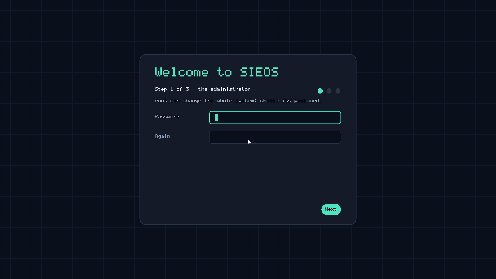
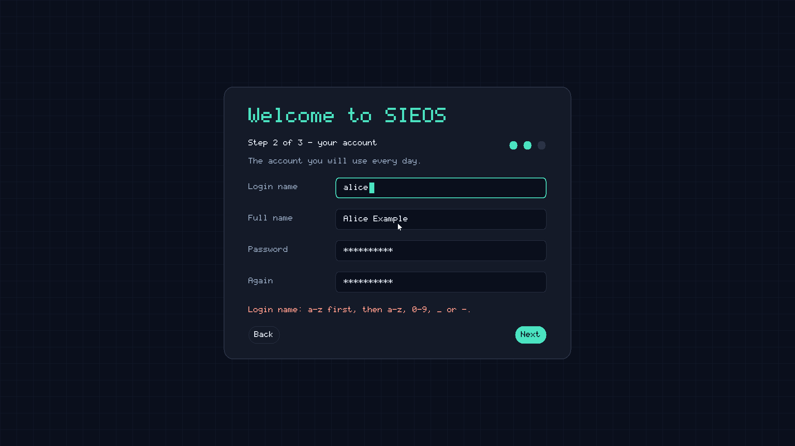
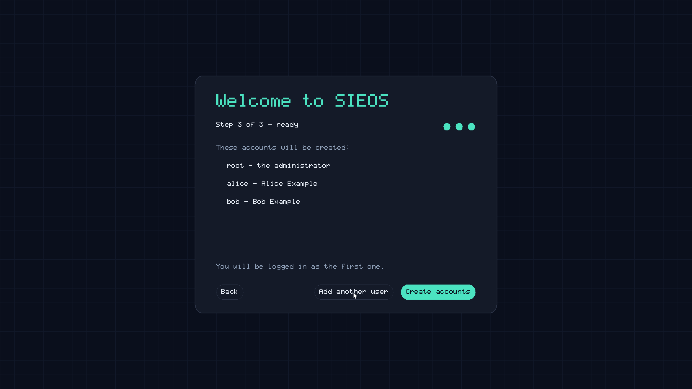

# Users and logins in SIEOS

Part of SIEOS. (c) Olivier Moulin. SPDX-License-Identifier: GPL-3.0-only

## Who is who

The kernel gives every process an identity when it starts: a user number
(uid), a group number (gid) and up to 16 more groups. It never changes
afterwards. The kernel stamps uid and gid on every message a process sends,
so a server always knows who asks; the other groups it can ask with
`SYS_IDENT`. uid 0 is **root**, the administrator.

Only root may start a program under another identity (`SYS_SPAWN` with a
uid, gid and groups). Every other program's children get their parent's
identity. There is nothing like a program that gains rights when run: a user
who needs something done that their identity does not allow asks a server
that is allowed, and that server decides.

## The pieces

```
kernel ─► init ─► con, vblk, fs          (boot modules, as root)
               ├► auth   (/bin/auth, root: accounts)
               └► login  (/bin/login: the console's prompt)
login ──AUTH_LOGIN──► auth ─► /bin/sh as the user, a child of login ─► reply: its pid
login waits for its child shell to end, then shows the prompt again
```

- **init** starts every service of its table and starts them again when
  they end (`user/init/init.c`, see [kernel.md](kernel.md), "When a server crashes").
  The kernel tells it about ended children with a message on its port
  (`SYS_CHILD_PORT`, `NOTE_CHILD`).
- **auth** (`user/auth/auth.c`) is the only program that reads the password
  hashes and changes the account files. It also starts sessions: after
  checking a password it starts the user's shell with the user's identity,
  as a child of the asker (`login`, or `su`), and answers with its pid; the
  asker waits for it. So sessions do not depend on auth: if auth crashes
  and is restarted, they go on.
- **login** only talks: it reads a name and a password (hidden) and asks
  auth. It never sees a hash.
- **passwd, su, useradd, userdel** are one program, `/bin/acct`, under four
  names (symbolic links). Each only asks auth.
- The **file server** checks every access with the caller's uid, gid and
  other groups (it asks for the groups only when they could matter, and
  keeps the answer).

## The first start

The disk image has no account and no password. The first start creates
them, **on the screen**: the desktop's welcome screen (`user/atlas/setup.c`)
takes you through three steps.

1. **The administrator:** root's password, twice.
2. **Your account:** login name, full name, password twice.
3. **Ready:** the list of accounts; "Add another user" (back to step 2, up
   to 4 users), "Back", "Create accounts".





Keys: Tab and Shift+Tab move between fields, Enter goes to the next field
(or step), Esc goes back a step; the mouse works too. Passwords are shown
as `*`. Nothing is created before "Create accounts": then everything goes
to auth in one request, and the first user is logged in at once (they have
just typed their password twice, so a login screen would only repeat it).

**The rules** (the welcome screen checks them as you go, and auth checks
them again; `passwd`, `useradd` and the terminal setup follow them too):

| | Rule |
|---|---|
| Login name | 1 to 31 characters: lower-case letters, digits, `_` or `-`; starts with a letter or `_`; not `root`; not twice in the list |
| Full name | up to 63 characters, no tab (empty: the login name) |
| Password | at least 8 characters, and not the account's name; typed twice, the same |

**Who may create the accounts.** auth decides, not the screen nor the
terminal:

```
   atlas (screen found) ──AUTH_DISPLAY 1──► auth: "the screen does it" (owner: atlas)
   login ──AUTH_STATE + AUTH_WAIT──► auth: no answer yet ... until the accounts
                                     exist (→ 1: the normal prompt)
   atlas ──AUTH_SETUP "rootpw\0name\0full\0pw..."──► auth: root? no account yet?
                                     the owner? all names and passwords valid?
                                     → users, then root last → answers login: 1
```

- Only a root process may announce a screen or create the accounts, and only
  while root has no account: before the first start, the only root
  processes are the system's own servers (no user exists yet).
- Only the owner may create them: the desktop that said "I do it", or, with
  no screen, the login prompt that was told so. A second client, or a second
  request after the accounts exist, gets `-EPERM`. auth serves one request
  at a time, so two attempts cannot interleave.
- Everything is checked before anything is written; the users are written
  first and root last, and "accounts exist" means "root's record exists":
  a first start cut short (power cut) leaves no root, and is simply done
  again (its leftovers are replaced).
- Until then, auth does not stop when idle (it keeps who owns the first
  start). If auth restarts meanwhile, the desktop announces itself again
  before creating the accounts.

**The terminal, only without a screen.** The serial console never creates
accounts while there is a screen: login prints "First start: please complete
the setup on the screen." and waits. There is no screen when the machine
has no display card (QEMU `-vga none`, e.g. `make run-nox`): the desktop
finds no display, tells auth so (`AUTH_DISPLAY 0`) and ends cleanly (init
does not restart it). login also asks init: if the desktop has ended for
good (stopped, or given up after crashing), it tells auth itself. Then, and
only then, login asks for root's password and a first user on the terminal.

auth creates `/root` and `/home/NAME` (both mode 0700), and the three files
below.

## The files

One record per line; fields separated by a tab; `#` starts a comment.
Each change is written to `FILE.new` and renamed over `FILE` in one step, so
a crash leaves the old file or the new one, never a mix.

| File | Mode | Fields |
|---|---|---|
| `/etc/users` | 0644 | name, uid, gid, home, shell, full name |
| `/etc/groups` | 0644 | name, gid, members (comma-separated names) |
| `/etc/secrets` | 0600 | name, method (`argon2id`), memory (KiB), passes, lanes, salt (hex), hash (hex) |

Users get uids from 1000 up. Each user has a group of their own (same
number). Users created after the first start are also members of `users`
(gid 100).

## Passwords: Argon2id

A password is never stored, only a hash of it: Argon2id (RFC 9106) with a
16-byte random salt from the kernel (`SYS_RANDOM`) and a 32-byte result.
Argon2id needs a lot of memory for every guess, which makes trying many
passwords with many machines expensive.

| Parameter | Value | Why |
|---|---|---|
| memory | 16 MiB | the most a small system should lend for a moment |
| passes | 24 | about 0.19 s per check inside SIEOS (KVM, one core) |
| lanes | 1 | one core |

The memory is taken just for the check, wiped and given back right after:
the accounts server stays at about 130 KiB. The parameters are stored with
each hash, so they can change later without breaking older passwords.

Other protections: a wrong password costs one more second; an unknown user
name costs the same time as a known one (no hint of which names exist);
comparisons take the same time wherever the bytes differ; passwords are
erased from memory after use.

## Rules

- A user may read and write their home, `/tmp` (but not delete other
  people's files there: it is "sticky"), and what the permissions allow.
- Only root may power off or restart the machine.
- `passwd`: anyone may change their own password (with the current one);
  root may set anyone's.
- `su NAME`: a shell as NAME, with NAME's password (root needs none). Type
  `exit` to come back.
- `userdel` keeps the user's home folder.
