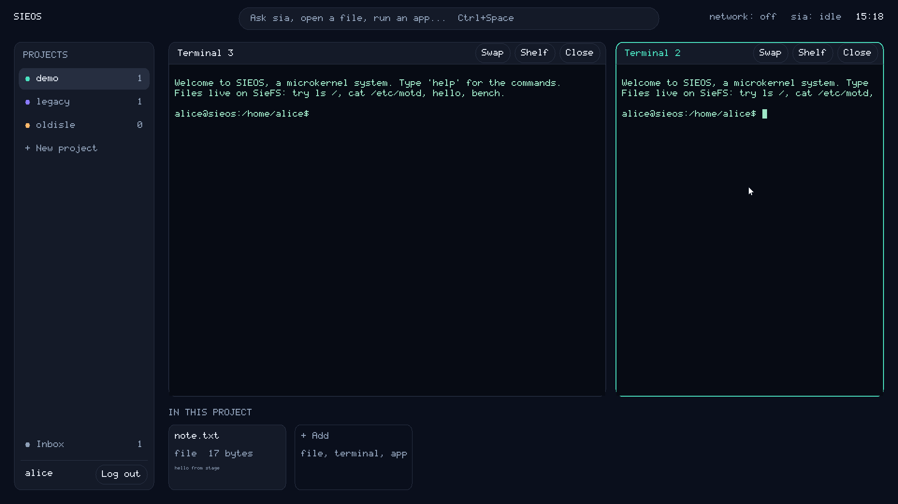
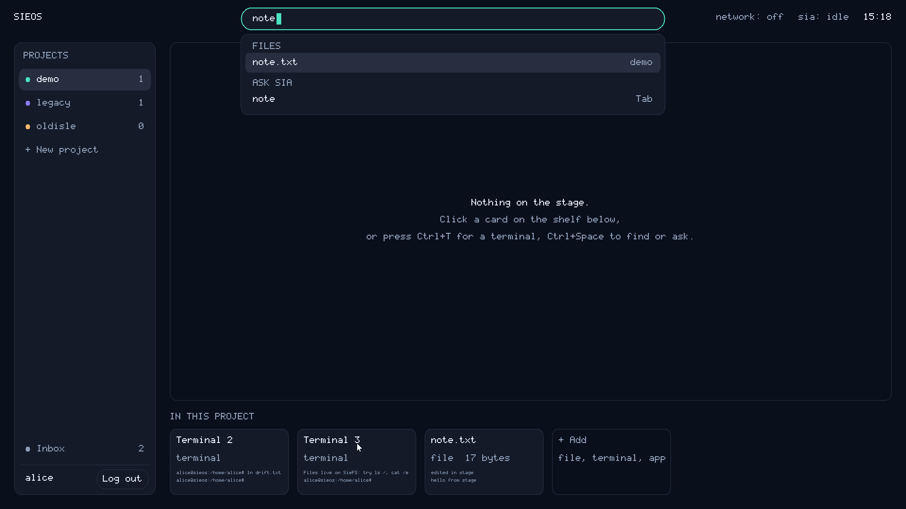
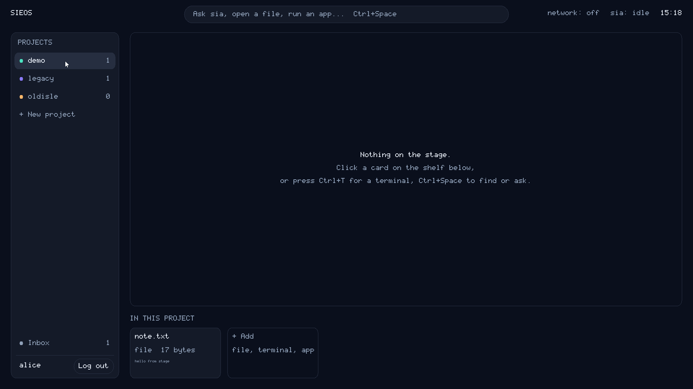
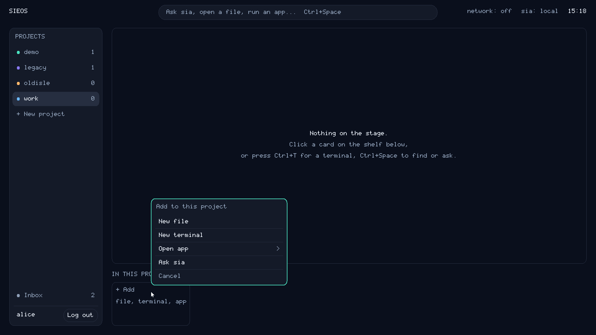
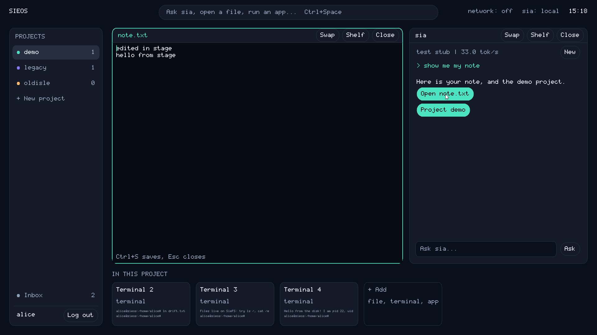
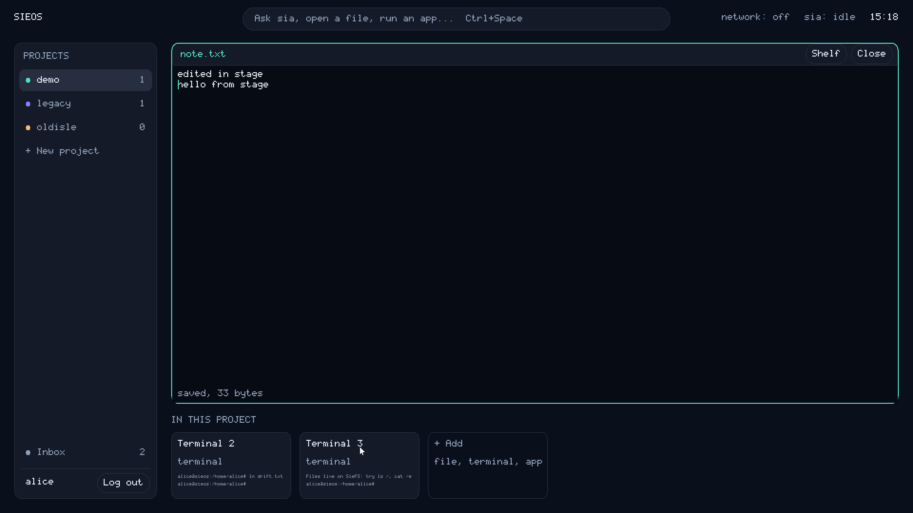
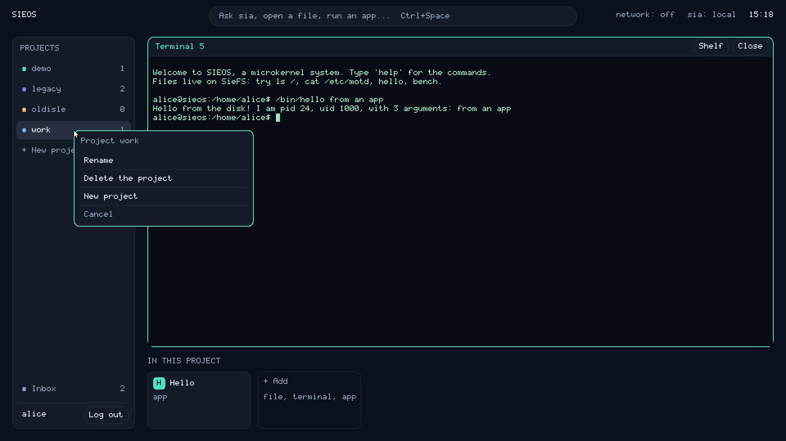
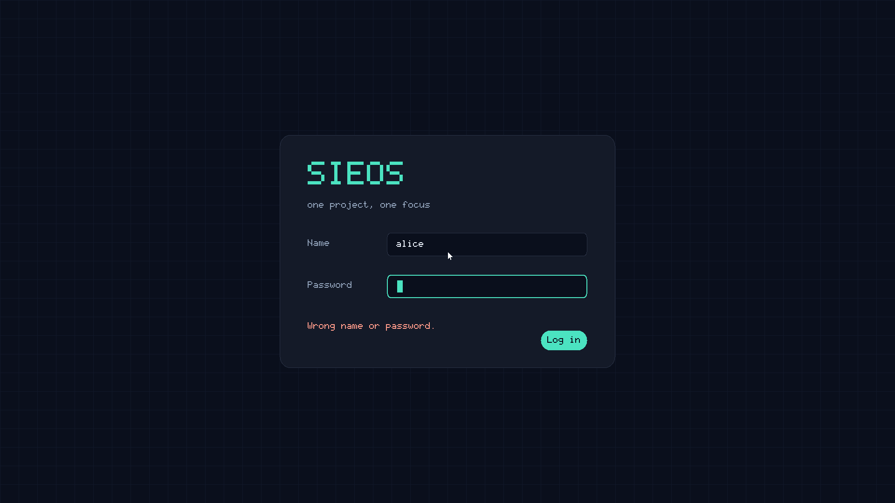

# The desktop: Stage

Part of SIEOS. SPDX-License-Identifier: GPL-3.0-only

The desktop (`user/atlas/`, the program `/bin/atlas`) shows **one project
at a time and one thing in focus**. There are four ideas to learn:
projects, the stage, the shelf and the Lens. This page is the tour first,
then the reference: what is stored where, the keys and the menus.



```
 ┌──────────── Lens: one line to find a file, start an app, ask sia ─── status, clock ┐
 │ PROJECTS  │ ┌──────────── main ────────────┐ ┌──── beside ────┐                     │
 │ ● demo  1 │ │ the window in focus (accent  │ │ optional,      │                     │
 │ ● notes 4 │ │ border): terminal, editor,   │ │ about 38 %     │                     │
 │ + New     │ │ or the assistant             │ │                │                     │
 │           │ └──────────────────────────────┘ └────────────────┘                     │
 │ ● Inbox 2 │ IN THIS PROJECT  [Terminal 2] [note.txt] [Hello] [+ Add]   the shelf     │
 └───────────┴──────────────────────────────────────────────────────────────────────────┘
```

## The four ideas

- **Projects** (the rail on the left, the only navigation). A file
  belongs to **one** project: its attribute `project` = `NAME`. Files
  without one are in the **Inbox**, at the bottom of the rail. The file
  server indexes attributes, so `find project=demo` lists a project at
  once. The number beside a project is how many files it has. Projects
  with no files yet (made with *+ New project*) are kept in
  `~/.projects`, one name per line. Click a project, or press Ctrl+1 to
  Ctrl+9, to go to it.
- **The stage** (the middle). It holds at most **two windows**: *main*
  (wide) and, if you want, one *beside* it (about 38 % of the width). A
  window is a **terminal** (a shell as you), the **editor** (one file), or
  the **assistant** (sia). The window with the keys has the accent
  border. Each window has three buttons in its title strip: *Swap* (main
  and beside change places), *Shelf* (it leaves the stage but keeps
  running), *Close* (it ends: a terminal's shell is stopped, the editor
  asks first if the file is not saved).
- **The shelf** (the bottom). It shows everything else in the project:
  its windows not on the stage, then its files, then its apps, as small
  cards drawn from their text (a terminal shows its last lines, a file its
  first lines, read only while the card is shown). No pictures are kept.
  - Click a card: it goes on main.
  - Drag a card up: onto the left half of the stage it goes on main,
    onto the right half it goes beside.
  - Drag a card onto a project of the rail: it **moves** there.
  - Right-click a card: *Open*, *Open beside*, *Move to project*, *Move
    to the Inbox* (files), *Close* (windows).
  - The last card, **+ Add**: *New file*, *New terminal*, *Open app*,
    *Ask sia*, all in this project.
  - The wheel over the shelf scrolls it when there are more cards than
    fit.
- **The Lens** (the line at the top, Ctrl+Space). Type a few letters to
  get grouped results: **Files** (by name, in every project), **Apps**
  (your apps and those of `/etc/apps`), and **Ask sia**. Enter opens the
  first result, Tab asks sia, Esc closes the results. Text starting with
  `?` only offers the question.

A window opened anywhere (Ctrl+T, an app, the assistant) belongs to the
project on the screen. Opening a file takes you to the file's project.







## Keys

| Keys | What they do |
|---|---|
| Ctrl+Space (or Ctrl+F) | the Lens |
| Ctrl+1 .. Ctrl+9 | the first nine projects of the rail |
| Ctrl+Tab | the project's next window on main |
| Ctrl+\ | beside: hide it, or show the shelf's first window there |
| Ctrl+W | the focused window goes to the shelf |
| Ctrl+T | a new terminal on main |
| Ctrl+S | save (editor) |
| Ctrl+V, middle button | paste (terminal, editor, assistant, Lens) |
| Esc | back: closes the Lens, a menu or a name box; in the editor, closes the file (twice if not saved); in the assistant, stops an answer |
| Page Up/Down, the wheel | a terminal's history (500 lines) |

Shift-click is not used: mouse events carry no modifier keys, so "open
beside" is a drag to the right half or the card's right-click menu.

## Windows

- **Terminals.** Each one is a shell started by `auth` **as you** (never
  as root), with its own console, `atlas#N`: the client library sends the
  shell's console requests to atlas, the window's number in `w[3]`. The
  terminal takes the size its slot gives it (main or beside), up to 132 x
  60 characters, with 500 lines of history (66 KiB per terminal, given
  back when it closes). Drag across the text to select it: it is copied
  at once.
- **The editor.** One file at a time, up to 64 KiB (bigger or binary
  files, or files you may not change: read only); the text is in memory
  only while it is open. Arrows, Home/End, Page Up/Down, Backspace, Del,
  Enter, Tab; Ctrl+S saves, Esc closes (twice if there are unsaved
  changes). Opening another file while this one has unsaved changes is
  refused, with a message on the top bar.
- **The assistant** (`panel.c`). A conversation with `sia`, shown as it is
  written. A thread of atlas does all the talking (`SIA_OPEN`, `SIA_ASK`,
  then `SIA_NEXT` piece after piece), so the desktop never waits. sia
  starts when you ask. *New* forgets the conversation, *Ask* (or Enter)
  asks, *Stop* (or Esc) ends an answer. When sia offers to remember
  something, a *Remember: ...* button keeps it (sia's memory). Answers may
  carry actions, each on a line of its own, shown as buttons:
  - `[fly:PATH]`: open that file (a path's end, like `note.txt`, is
    enough); the assistant stays beside it;
  - `[project:NAME]`: go to that project;
  - `[island:KEY=VALUE]`: list the files with that attribute in the Lens.

  The first question of a conversation tells the model these conventions
  and lists your files with their projects.





## Apps

An app is a small text file of our own format, ending in `.app`:

```
# A SIEOS app launcher (docs/desktop.md): key=value lines.
name=Hello
run=/bin/hello
args=from an app
kind=terminal
```

| Key | Meaning |
|---|---|
| `name` | what the card, the Lens and the menus show |
| `run` | the program (absolute path) |
| `args` | its arguments (one line) |
| `kind` | `terminal`: runs in a new terminal; `editor`: asks for a file name and opens the editor |

- Everyone's apps are in `/etc/apps`: Shell, Assistant chat, Text editor,
  Services, Hello, Fetch a web page, Disk benchmark.
- *+ Add* → *Open app* copies the launcher to `~/apps` (once) and puts it
  in the project: from then on it is a card on that project's shelf, and
  can be moved like a file. An app started from the Lens is not copied.
- Starting an app opens a terminal **as you** in the current project; its
  shell runs the app's command when it first asks for a line. When the
  app ends, the shell stays (`exit` closes it).

## Projects: the menus

Right-click a project of the rail:

| Entry | What it does |
|---|---|
| Rename | every file's `project` attribute is changed to the new name; its windows follow |
| Delete the project | asks first; then only the attribute goes: the files go to the Inbox, nothing is deleted |
| New project | a name box; the project is empty until something is put in it |

Right-click the Inbox or the empty rail: *New project*. Both Rename and
Delete skip the files you may not change, and say how many.



## Attributes and files

| What | Where |
|---|---|
| a file's project | attribute `project` = `NAME` (none: the Inbox) |
| empty projects | `~/.projects`, one name per line |
| apps opened in a project | `~/apps/*.app` (with their `project`) |

A project that loses its last file by a move from the desktop stays on
the rail (it is added to `~/.projects`). Hard links share attributes, so
they share a project.

**From the older map desktop (Atlas).** Files carried `island.NAME` =
`1` attributes (several per file) and places in `atlas.*`. The first time
the desktop sees such a file, the first island that is not Driftwood
becomes its project, and the `island.*` and `atlas.*` attributes are
removed (Driftwood alone means the Inbox). Empty islands listed in
`~/.islands` become empty projects, and that file is removed. Files you
may not change are shown that way but left alone.

## How it works

One process does the whole desktop, supervised by init like every server.
That keeps it small: no display server, no window pictures copied
between processes.

```
   con ──input events (CON_INPUT)──► atlas ◄── CON_WRITE / CON_READ to "atlas#N" ── sh
   (keyboard, mouse)                   │  ├── AUTH_LOGIN ──► auth ── starts ──► sh (as you)
                                       │  └── SIA_ASK / SIA_NEXT (its own thread) ──► sia
                                       └── draws ──► video memory
```

- **The screen** (`screen.c`): x86, QEMU's standard VGA card or the UEFI
  firmware's screen (GOP); AArch64, QEMU's ramfb on `virt`, the
  firmware's framebuffer on the Pi 4, `simple-framebuffer` on the Pi 5.
  The layout is computed from the screen's size (1920 x 1080 by
  default); below 1600 pixels wide the rail and the margins are narrower.
- **Drawing** (`draw.c`): a display list (rectangles with round corners,
  outlines, text) turned into pixels 16 rows at a time in a 120 KiB
  strip, each finished strip copied to video memory. No second
  full-screen image, and only the region that changed is redrawn: the
  pointer's two small squares, a terminal's window, the clock's corner.
- **The font** (`tools/mkfont.py` -> `font.c`): drawn for SIEOS, 6 x 11
  pixels a cell, shown twice as large (12 x 22) on the desktop.
- **Nothing runs when nothing happens:** no animation, no timer except
  the clock thread, which sleeps until the next minute. Atlas looks at the
  files again when a terminal's shell asks for its next line (a command
  has just run), so a `tag` shows at once, with no polling.
- **Login:** the login screen first (the password goes to `auth`, which
  starts your first shell, on main, in your first project); on a new
  disk, the welcome screen creates the accounts first
  (`user/atlas/setup.c`, [accounts.md](accounts.md)).
- **Rights:** atlas runs as root (it owns the screen and starts your
  shells through `auth`), so before it reads a file's text, changes its
  attributes, makes a file or starts an app, it checks the rights of the
  user logged in. Files it makes (new files, `~/apps`, `~/.projects`) are
  given to that user.
- **If atlas crashes** (or is killed), init starts it again within a few
  milliseconds: the login screen comes back, the old session's shells end,
  and the projects are still there (they are in the files). If con
  crashes, atlas takes the keyboard and mouse again as soon as the new con
  is up.



## Measurements

QEMU, x86-64 with KVM, 4 CPUs, 1920 x 1080 (`make gui-test`); AArch64
`virt`, emulated (`make ARCH=arm64 gui-test`).

| | x86-64 | AArch64 (emulated) |
|---|---|---|
| a full frame (whole screen) | median 4.1 ms (max 13 ms) | median 14 ms (max 22 ms) |
| atlas, end of the test (2 terminals) | 732 KiB | 9.7 MiB (8 MiB of it the ramfb picture) |
| atlas with 4 terminals and the assistant | 860 KiB | |
| the whole system, session open | 3.6 MiB | 13.8 MiB |
| idle | no work: the clock thread wakes once a minute | same |

Most pictures are partial (a terminal's window, the pointer), far cheaper
than a full frame. For comparison, the map desktop (Atlas) used 916 KiB
with 4 terminals, and the whole system 3.6 to 3.9 MiB.

## Tests

`make gui-test` (x86-64, gcc) and `make ARCH=arm64 gui-test` (AArch64,
sicc) drive QEMU through its control socket: the first start on the
screen; projects from `tag`, and the migration of `island.*` attributes,
Driftwood and `~/.islands`; two terminals on the stage (both checked to
run as the user, uid 1000), a card dragged beside, *Swap*, Ctrl+W, Ctrl+\,
Ctrl+Tab; history, copy and paste; the editor (save, read back by the
shell); the Lens (a file, an app, a question to the stand-in sia, Esc);
the answer's buttons and Stop; *+ New project*, *+ Add* → *New file* and
*Open app*; a card dragged onto another project; Rename; atlas killed and
restarted by init with the projects kept; Delete (the files go to the
Inbox); the console server killed. With `/tmp/atlas.debug` present
(the test makes it), atlas logs where it drew the projects, cards, window
buttons and terminals, and the time of each full frame; nothing is
logged without it. `make gui-test-real` does the same with the real sia
and a model on the test disk.
